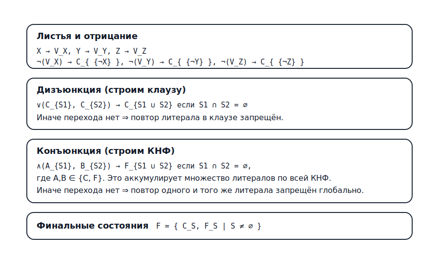
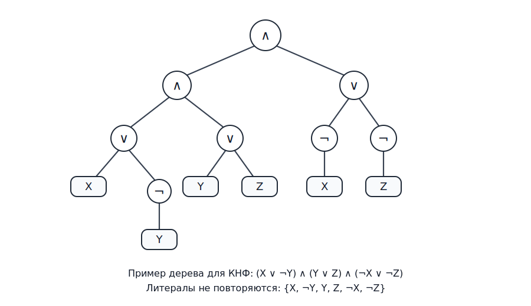
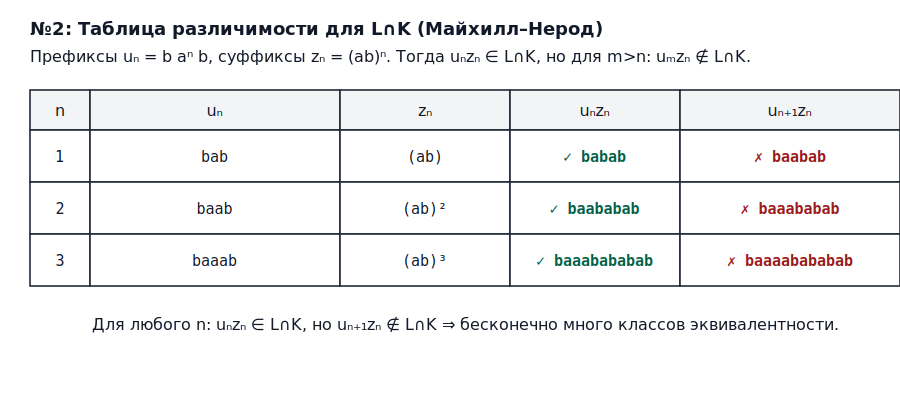
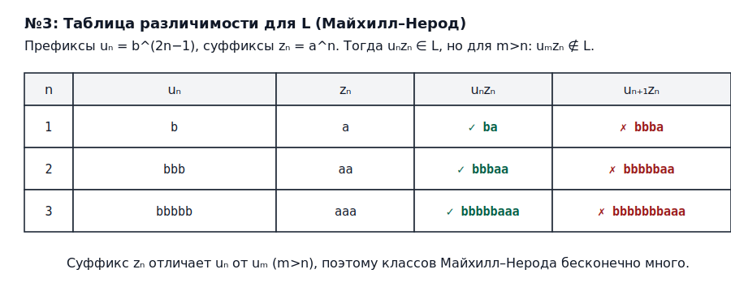

# РК1. Вариант 6 — проверка регулярности языков

## №1. Язык деревьев КНФ над связками $\wedge,\vee,\neg$

**Постановка.** Рассматриваются деревья логических выражений над алфавитом:
- листья: $X,Y,Z$;
- унарный узел: $\neg$;
- бинарные узлы: $\vee$ и $\wedge$,

такие, что выражение находится в **КНФ** (конъюнкция дизъюнкций), причём **повторные вхождения одинаковых атомов** (литералов) из множества
$$
\mathcal L=\{X,\neg X,Y,\neg Y,Z,\neg Z\}
$$
**не допускаются** (т.е. ни один литерал из $\mathcal L$ не встречается в дереве более одного раза).

Требуется проверить регулярность и (если регулярен) построить автомат.

---

### Ответ: язык регулярный

Так как возможных литералов всего 6, ограничения «КНФ-структура + отсутствие повторов» проверяются конечной памятью. Построим явный древесный автомат.

---

### Древесный автомат

Обозначим через $S\subseteq\mathcal L$ множество литералов, встречающихся в уже обработанном поддереве.

Состояния автомата:
- $V_X,V_Y,V_Z$ — «листовая переменная» (нужна, чтобы разрешить $\neg$ только над переменной);
- $C_S$ для всех непустых $S\subseteq\mathcal L$ — «клауза» (дизъюнкция литералов) с точным множеством литералов $S$;
- $F_S$ для всех непустых $S\subseteq\mathcal L$ — «КНФ-формула» (конъюнкция клауз) с точным множеством литералов $S$.

Финальные состояния:
$$
F=\{\,C_S\mid S\neq\varnothing\,\}\ \cup\ \{\,F_S\mid S\neq\varnothing\,\}.
$$
(Это позволяет принимать как КНФ из одной клаузы, так и конъюнкцию нескольких клауз.)

---

### Правила перехода

Схема:

**Листья**
$$
X\to V_X\ \mid\ C_{\{X\}},\qquad
Y\to V_Y\ \mid\ C_{\{Y\}},\qquad
Z\to V_Z\ \mid\ C_{\{Z\}}.
$$

**Отрицание (только над переменной)**
$$
\neg(V_X)\to C_{\{\neg X\}},\qquad
\neg(V_Y)\to C_{\{\neg Y\}},\qquad
\neg(V_Z)\to C_{\{\neg Z\}}.
$$

**Дизъюнкция (строим клаузу, запрещая повторы литералов)**
$$
\vee(C_{S_1},C_{S_2})\to C_{S_1\cup S_2}\quad\text{если }S_1\cap S_2=\varnothing.
$$
Если $S_1\cap S_2\neq\varnothing$, перехода нет.

---

### Вид принимаемых деревьев (структура)

По правилам автомата узел $\vee$ всегда строит состояние вида $C_S$, а узел $\wedge$ — состояние вида $F_S$; поэтому в любом принимаемом дереве все $\wedge$ расположены выше всех $\vee$, то есть дерево кодирует конъюнкцию клауз.

**Конъюнкция (строим КНФ, запрещая повторы литералов глобально)**
$$
\wedge(A_{S_1},B_{S_2})\to F_{S_1\cup S_2}
\quad\text{если }S_1\cap S_2=\varnothing,
$$
где $A_{S_1}\in\{C_{S_1},F_{S_1}\}$ и $B_{S_2}\in\{C_{S_2},F_{S_2}\}$.
Если $S_1\cap S_2\neq\varnothing$, перехода нет.

---

### Вывод

Построен конечный древесный автомат, распознающий язык. Следовательно, язык **регулярен**.

---

## №2. Язык $L=\{w_1w_2\mid |w_1|_{ab}=|w_1|_{ba},\ |w_2|_{ab}=|w_1|_{a},\ w_1,w_2\in\{a,b\}^+\}$

Здесь $|w|_{ab}$ — число вхождений подслова `ab` в $w$, аналогично $|w|_{ba}$, а $|w|_a$ — число букв `a` в $w$.

### Ответ: язык **нерегулярный**

Докажем от противного, используя **таблицу опровержения (Майхилл–Нерод)** после пересечения с регулярным языком.

---

### Шаг 1. Пересечение с регулярным языком

Рассмотрим регулярный язык
$$
K = b\,a^+\,b\,(ab)^+.
$$
Он задаётся регулярным выражением `b a+ b (ab)+`.

Достаточно показать, что $L\cap K$ нерегулярен: если бы $L$ был регулярным, то и $L\cap K$ был бы регулярным (замкнутость регулярных языков относительно пересечения).

---

### Шаг 2. Описание $L\cap K$

Возьмём слово из $K$:
$$
w=b\,a^m\,b\,(ab)^k,\quad m\ge 1,\ k\ge 1.
$$

Пусть $w=w_1w_2$ удовлетворяет условиям $L$.

Для любого непустого слова $u\in\{a,b\}^+$ выполняется:
$$
|u|_{ab}-|u|_{ba}=
\begin{cases}
0,& \text{если }u\text{ начинается и заканчивается одной буквой},\\
1,& \text{если }u\text{ начинается на }a\text{ и заканчивается на }b,\\
-1,& \text{если }u\text{ начинается на }b\text{ и заканчивается на }a.
\end{cases}
$$
Следовательно, условие $|w_1|_{ab}=|w_1|_{ba}$ эквивалентно: **$w_1$ начинается и заканчивается одной и той же буквой.**

Так как $w$ начинается на `b`, то и $w_1$ начинается на `b`, значит $w_1$ должен **заканчиваться на `b`**. В слове $b a^m b (ab)^k$ это означает, что существует $t\ge 0$, $t\le k-1$, такое что
$$
w_1=b\,a^m\,b\,(ab)^t,\qquad w_2=(ab)^{k-t}.
$$
Тогда
$$
|w_1|_a=m+t,\qquad |w_2|_{ab}=k-t,
$$
и условие $|w_2|_{ab}=|w_1|_a$ даёт
$$
k-t=m+t\quad\Longleftrightarrow\quad k=m+2t.
$$

Итак,
$$
L\cap K=\{\,b\,a^m\,b\,(ab)^k\mid m\ge 1,\ k\ge 1,\ k\ge m,\ k\equiv m\pmod 2\,\}.
$$

---

### Шаг 3. Таблица различимости (Майхилл–Нерод) для $L\cap K$

Рассмотрим бесконечное множество префиксов
$$
u_m=b\,a^m\,b,\quad m=1,2,3,\dots
$$
и суффиксы
$$
z_m=(ab)^m.
$$

Тогда для каждого $m\ge 1$:
- $u_m z_m = b\,a^m\,b\,(ab)^m \in L\cap K$ (берём $t=0$, тогда $k=m$);
- если $n>m$, то
$$
  u_n z_m = b\,a^n\,b\,(ab)^m \notin L\cap K,
$$
  потому что в $L\cap K$ обязательно $k\ge m$ и при данном разбиении $k=m<n$ нарушается условие $k\ge n$ (эквивалентно «невозможно подобрать $t\ge 0$ так, чтобы $m=n+2t$»).

Значит, для любых $n>m$ префиксы $u_n$ и $u_m$ **различимы** суффиксом $z_m$.

Можно оформить это как «таблицу различимости»:

| пара префиксов | различающий суффикс $z$ | $u_m z$ | $u_n z$ |
|---|---|---:|---:|
| $u_m=b a^m b$ и $u_n=b a^n b$ ($n>m$) | $(ab)^m$ | $\in L\cap K$ | $\notin L\cap K$ |

Следовательно, у $L\cap K$ бесконечно много классов эквивалентности Майхилл–Нерода, то есть $L\cap K$ **нерегулярен**. Тогда и $L$ **нерегулярен**.

---

### Вывод

Язык из пункта №2 **не является регулярным**.

---

## №3. Язык $L=\{w_1 v w_2\mid w_2=h(w_1),\ h(a)=aa,\ h(b)=a,\ |v|<|w_1|\}$

Здесь $h$ — гомоморфизм: каждая буква заменяется строкой, значит
$$
h(w_1)\in \{a\}^*,\qquad |h(w_1)| = 2|w_1|_a + |w_1|_b = |w_1| + |w_1|_a \ge |w_1|.
$$

### Ответ: язык **нерегулярный**

Докажем через **таблицу опровержения (Майхилл–Нерод)** напрямую.

---

### Рассмотрим последовательность слов:

Для каждого $n\ge 1$ рассмотрим слово
$$
s_n = b^{2n-1} a^{n}.
$$
Покажем, что $s_n\in L$: возьмём разбиение
$$
w_1=b^n,\quad v=b^{n-1},\quad w_2=h(w_1)=h(b^n)=a^n.
$$
Тогда $s_n=w_1 v w_2$ и $|v|=n-1<|w_1|=n$, значит $s_n\in L$.

---

### Различимость префиксов

Положим
$$
u_n=b^{2n-1},\qquad z_n=a^n.
$$
Тогда $u_n z_n = s_n\in L$ для всех $n$.

Пусть теперь $m>n$. Докажем, что
$$
u_m z_n = b^{2m-1} a^n \notin L.
$$

Предположим противное: $b^{2m-1} a^n = w_1 v w_2\in L$, где $w_2=h(w_1)$ и $|v|<|w_1|$.
Так как хвост $w_2=h(w_1)$ состоит только из букв `a`, то в префиксе $w_1 v$ не может быть букв `a` (иначе в слове появилась бы `a` до финального блока $a^n$).
Значит, $w_1$ и $v$ состоят только из `b`, то есть $w_1=b^k$ для некоторого $k\ge 1$.

Тогда
$$
w_2=h(w_1)=h(b^k)=a^k.
$$
Но $w_2$ совпадает с финальным блоком $a^n$, поэтому $k=n$ и $w_1=b^n$.

Следовательно, длина $v$ равна
$$
|v| = (2m-1) - |w_1| = (2m-1)-n = 2m-n-1.
$$
Условие $|v|<|w_1|=n$ даёт
$$
2m-n-1 < n \quad\Longleftrightarrow\quad 2m-1 < 2n \quad\Longleftrightarrow\quad m\le n,
$$
что противоречит $m>n$.

Значит, $u_m z_n\notin L$.

---

### Таблица различимости

Для любых $m>n$ суффикс $z_n=a^n$ различает префиксы $u_n$ и $u_m$:

| пара префиксов | различающий суффикс $z$ | $u_n z$ | $u_m z$ |
|---|---|---:|---:|
| $u_n=b^{2n-1}$ и $u_m=b^{2m-1}$ ($m>n$) | $a^n$ | $\in L$ | $\notin L$ |

Следовательно, у $L$ бесконечно много классов Майхилл–Нерода, то есть $L$ **нерегулярен**.

---

### Вывод

Язык из пункта №3 **не является регулярным**.

