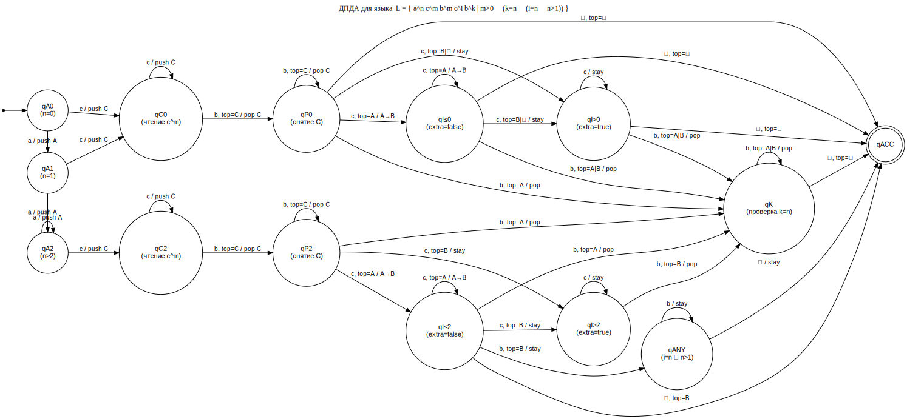

# РК2 — Вариант 6 — Задача 2

## Условие

Дан язык над алфавитом $\Sigma=\{a,b,c\}$:

$$
L=\Bigl\{\,a^n c^m b^m c^i b^k\ \Bigm|\ m>0\ \land\ \bigl(k=n\ \lor\ (i>1\ \land\ i=n)\bigr)\Bigr\},
$$

где $n,m,i,k\in\mathbb{N}$.

Требуется определить, является ли $L$ детерминированно контекстно-свободным (DCFL).

---

## Решение

Покажем, что $L\in\mathrm{DCFL}$, построив **детерминированный магазинный автомат (ДПДА)**, распознающий $L$.
Следовательно, $L\in\mathrm{CFL}$ тоже верно.

### Ключевая идея

После чтения префикса $a^n c^m b^m$ автомат:

1) проверяет равенство в середине $c^m b^m$ и условие $m>0$ (стековыми символами $C$);
2) сохраняет в стеке число $n$ в виде $A^n$;
3) на хвосте $c^i b^k$ детерминированно делает следующее:

   - на блоке $c^i$ **не уничтожает** информацию о $n$, а перекодирует $A\to B$ (сохраняя общее число $n$ в стеке),
     и фиксирует факт $i>n$ отдельным флагом (`extra=true/false`);
   - если установлено $i=n$ и $n>1$, принимает независимо от $k$;
   - иначе детерминированно проверяет $k=n$, снимая по одному символу из $\{A,B\}$ на каждый `b`.

---

## ДПДА

Будем считать, что вход заканчивается маркером конца $\dashv\notin\{a,b,c\}$.
Тогда входной алфавит $\Sigma'=\{a,b,c,\dashv\}$.

**Алфавит стека:** $\Gamma=\{\bot,A,B,C\}$, где $\bot$ — нижний маркер.  
**Старт:** состояние $q_{A0}$, стек $\bot$.  
**Принятие:** по допускающему состоянию $q_{\mathrm{ACC}}$.

### Диаграмма (SVG)

> Все переходы, не указанные на диаграмме и в описании ниже, считаются отсутствующими (то есть слово отвергается).

---

## Описание состояний и переходов

### Состояния

- $q_{A0},q_{A1},q_{A2}$: чтение $a^n$ и фиксация факта $n\ge 2$ (соответственно $n=0$, $n=1$, $n\ge 2$); при чтении `a` кладём $A$.
- $q_{C0},q_{C2}$: чтение $c^m$ и накопление $C^m$ в стеке (индекс $0/2$ соответствует флагу $n\ge2$).
- $q_{P0},q_{P2}$: чтение $b^m$ и выталкивание $C^m$.
- $q_{I\le}^{0},q_{I\le}^{2}$: чтение $c^i$ при условии `extra=false` (то есть пока не обнаружено $i>n$).
- $q_{I>}^{0},q_{I>}^{2}$: чтение $c^i$ при условии `extra=true` (уже обнаружено $i>n$).
- $q_K$: проверка $k=n$ (выталкиваем по одному $A$ или $B$ на каждый `b`).
- $q_{\mathrm{ANY}}$: ветвь, когда уже установлено $i=n$ и $n>1$ (тогда $k$ произволен).
- $q_{\mathrm{ACC}}$: принимающее состояние.

---

### Переходы

#### 1) Блок $a^n$

- $q_{A0}\xrightarrow{\;a\;/\;\text{push }A\;} q_{A1}$
- $q_{A1}\xrightarrow{\;a\;/\;\text{push }A\;} q_{A2}$
- $q_{A2}\xrightarrow{\;a\;/\;\text{push }A\;} q_{A2}$

Переход к $c^m$ (первый `c` гарантирует $m>0$):

- $q_{A0}\xrightarrow{\;c\;/\;\text{push }C\;} q_{C0}$
- $q_{A1}\xrightarrow{\;c\;/\;\text{push }C\;} q_{C0}$
- $q_{A2}\xrightarrow{\;c\;/\;\text{push }C\;} q_{C2}$

#### 2) Блок $c^m$

Для $t\in\{0,2\}$:

- $q_{Ct}\xrightarrow{\;c\;/\;\text{push }C\;} q_{Ct}$
- $q_{Ct}\xrightarrow{\;b\;,\ \text{top}=C\;/\;\text{pop}\;} q_{Pt}$

#### 3) Блок $b^m$

Для $t\in\{0,2\}$:

- $q_{Pt}\xrightarrow{\;b\;,\ \text{top}=C\;/\;\text{pop}\;} q_{Pt}$

Когда $C$ закончились (то есть $\text{top}\ne C$), начинается хвост $c^i b^k$.

Из $q_{P0}$:

- при `c`:
  - если $\text{top}=A$: заменить $A\to B$, переход в $q_{I\le}^{0}$;
  - если $\text{top}=B$ или $\text{top}=\bot$: переход в $q_{I>}^{0}$ (это означает $i>n$ либо $n=0$).
- при `b` и $\text{top}\in\{A,B\}$: pop и переход в $q_K$ (случай $i=0$).
- при $\dashv$ и $\text{top}=\bot$: переход в $q_{\mathrm{ACC}}$ (случай $n=i=k=0$).

Из $q_{P2}$:

- при `c`:
  - если $\text{top}=A$: заменить $A\to B$, переход в $q_{I\le}^{2}$;
  - если $\text{top}=B$ или $\text{top}=\bot$: переход в $q_{I>}^{2}$ (случай $i>n$).
- при `b` и $\text{top}\in\{A,B\}$: pop и переход в $q_K$ (случай $i=0$).

#### 4) Блок $c^i$: перекодирование и фиксация $i>n$

Для $t\in\{0,2\}$.

В состояниях $q_{I\le}^{t}$:

- при `c` и $\text{top}=A$: заменить $A\to B$, остаёмся в $q_{I\le}^{t}$;
- при `c` и $\text{top}\in\{B,\bot\}$: переходим в $q_{I>}^{t}$
  (первый `c` после исчерпания $A$ означает $i>n$).

В состояниях $q_{I>}^{t}$:

- при `c`: остаёмся в $q_{I>}^{t}$.

#### 5) Переход на $b^k$ или конец слова

Распознаём дизъюнкт $i=n\land n>1$:

- из $q_{I\le}^{2}$ при чтении `b` и $\text{top}=B$: переходим в $q_{\mathrm{ANY}}$ (ветвь $i=n\land n>1$ выполнена);
- из $q_{I\le}^{2}$ при чтении $\dashv$ и $\text{top}=B$: принимаем (случай $k=0$ допустим).

Во всех остальных случаях переходим к проверке $k=n$:

- из $q_{I\le}^{0},q_{I>}^{0},q_{I\le}^{2},q_{I>}^{2}$ при `b` и $\text{top}\in\{A,B\}$: pop и переход в $q_K$.

Также:

- из $q_{I\le}^{0}$ или $q_{I>}^{0}$ при $\dashv$ и $\text{top}=\bot$: принимаем (это означает $k=0=n$).

#### 6) Проверка $k=n$ (состояние $q_K$)

- при `b` и $\text{top}\in\{A,B\}$: pop, остаёмся в $q_K$;
- при `b` и $\text{top}=\bot$: отказ (лишние `b`, то есть $k>n$);
- при $\dashv$ и $\text{top}=\bot$: переходим в $q_{\mathrm{ACC}}$;
- при $\dashv$ и $\text{top}\in\{A,B\}$: отказ (не хватило `b`, то есть $k<n$).

#### 7) Ветвь $i=n\land n>1$ (состояние $q_{\mathrm{ANY}}$)

- при `b`: остаёмся в $q_{\mathrm{ANY}}$;
- при $\dashv$: переходим в $q_{\mathrm{ACC}}$.

---

## Корректность

1) **Середина $c^m b^m$ и $m>0$** корректно проверяются символами $C$:
   $m\ge1$ обеспечивается обязательным чтением первого `c` из $q_{A*}$ в $q_{C*}$,
   а равенство количеств `c` и `b` обеспечивается выталкиванием ровно по одному $C$ на каждый `b`.

2) На хвосте $c^i$ автомат хранит $n$ в стеке и ведёт инвариант:
   после чтения $c^i$ стек имеет вид
   $B^{\min(i,n)}A^{n-\min(i,n)}$,
   а флаг `extra` равен `true` тогда и только тогда, когда $i>n$.

3) Ветка $q_{\mathrm{ANY}}$ достижима ровно когда $n\ge2$, `extra=false` и все $A$ уже перекодированы (то есть $\text{top}=B$),
   что эквивалентно $i=n$ и $n>1$. Тогда автомат принимает при любом $k$, как требует язык.

4) Если ветка $i=n\land n>1$ не сработала, автомат проверяет $k=n$ в $q_K$ детерминированно:
   он снимает ровно по одному стековому символу на каждый `b` и принимает на конце слова тогда и только тогда, когда символы закончились ровно вместе с входом, то есть $k=n$.

5) **Детерминизм:** в автомате нет $\varepsilon$-переходов, и для каждого состояния и пары (входной символ, верх стека) задан не более одного перехода.

---

## Итог

Построен детерминированный магазинный автомат, распознающий $L$. Поэтому:

$$
\boxed{L\in\mathrm{DCFL}} \quad (\text{и, следовательно, } L\in\mathrm{CFL}).
$$
