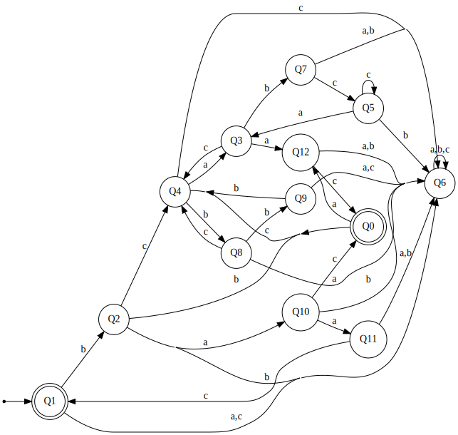
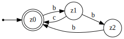
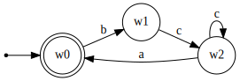
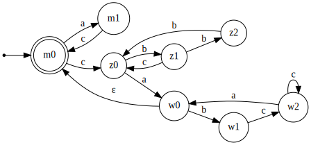
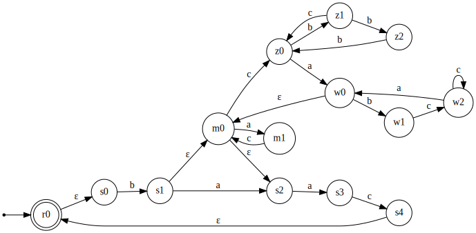

# Минимальный ДКА

Дано регулярное выражение над алфавитом $\Sigma=\{a,b,c\}$:
$$
R=\bigl(b\,(a\mid(\,c(bbb\mid bc)^*a(bcc^*a)^*\mid ac\,)^*)\,ac\bigr)^*.
$$

Так как снаружи стоит звезда Клини, $\varepsilon\in L(R)$, значит начальное состояние автомата принимающее.

Также слово `bac` принадлежит языку: внутренняя звезда может дать $\varepsilon$, и один блок равен
$b\varepsilon ac = bac$.

---

## Корректный ДКА (таблица переходов)

**Диаграмма (SVG):**

> Примечание: все неуказанные на схеме переходы ведут в ловушку $Q6$ (и в таблице $\delta(Q6,a)=\delta(Q6,b)=\delta(Q6,c)=Q6$).

Ниже приведён полный ДКА, распознающий $L(R)$.

Начальное состояние: $Q1$  
Принимающие состояния: $\{Q0,Q1\}$

| q   | a   | b   | c   |
|-----|-----|-----|-----|
| Q0  | Q12 | Q2  | Q4  |
| Q1  | Q6  | Q2  | Q6  |
| Q2  | Q10 | Q6  | Q4  |
| Q3  | Q12 | Q7  | Q4  |
| Q4  | Q3  | Q8  | Q6  |
| Q5  | Q3  | Q6  | Q5  |
| Q6  | Q6  | Q6  | Q6  |
| Q7  | Q6  | Q6  | Q5  |
| Q8  | Q6  | Q9  | Q4  |
| Q9  | Q6  | Q4  | Q6  |
| Q10 | Q11 | Q6  | Q0  |
| Q11 | Q6  | Q6  | Q1  |
| Q12 | Q6  | Q6  | Q0  |

---

## Минимальность 

Будем уточнять разбиение на классы эквивалентности.  
На шаге $K$ для каждого состояния $q$ выписываем тройку классов
$$
\bigl([\delta(q,a)]_K,\;[\delta(q,b)]_K,\;[\delta(q,c)]_K\bigr),
$$
и внутри каждого класса делим состояния по различающимся тройкам.

### Шаг K=0
Разбиение:
{Q0,Q1} | {Q2,Q3,Q4,Q5,Q6,Q7,Q8,Q9,Q10,Q11,Q12}

| состояние | класс | тройка (a,b,c) |
|---|---:|---|
| Q0 | 1 | (2,2,2) |
| Q1 | 1 | (2,2,2) |
| Q2 | 2 | (2,2,2) |
| Q3 | 2 | (2,2,2) |
| Q4 | 2 | (2,2,2) |
| Q5 | 2 | (2,2,2) |
| Q6 | 2 | (2,2,2) |
| Q7 | 2 | (2,2,2) |
| Q8 | 2 | (2,2,2) |
| Q9 | 2 | (2,2,2) |
| Q10 | 2 | (2,2,1) |
| Q11 | 2 | (2,2,1) |
| Q12 | 2 | (2,2,1) |

Отсюда отделяется класс {Q10,Q11,Q12}.

---

### Шаг K=1
Разбиение:
{Q0,Q1} | {Q2,Q3,Q4,Q5,Q6,Q7,Q8,Q9} | {Q10,Q11,Q12}

| состояние | класс | тройка (a,b,c) |
|---|---:|---|
| Q0 | 1 | (3,2,2) |
| Q1 | 1 | (2,2,2) |
| Q2 | 2 | (3,2,2) |
| Q3 | 2 | (3,2,2) |
| Q4 | 2 | (2,2,2) |
| Q5 | 2 | (2,2,2) |
| Q6 | 2 | (2,2,2) |
| Q7 | 2 | (2,2,2) |
| Q8 | 2 | (2,2,2) |
| Q9 | 2 | (2,2,2) |
| Q10 | 3 | (3,2,1) |
| Q11 | 3 | (2,2,1) |
| Q12 | 3 | (2,2,1) |

Отсюда отделяются {Q0}, {Q1}, {Q10}, а также {Q2,Q3} и {Q11,Q12}.

---

### Шаг K=2
Разбиение:
{Q0} | {Q1} | {Q2,Q3} | {Q4,Q5,Q6,Q7,Q8,Q9} | {Q10} | {Q11,Q12}

| состояние | класс | тройка (a,b,c) |
|---|---:|---|
| Q0 | 1 | (6,3,4) |
| Q1 | 2 | (4,3,4) |
| Q2 | 3 | (5,4,4) |
| Q3 | 3 | (6,4,4) |
| Q4 | 4 | (3,4,4) |
| Q5 | 4 | (3,4,4) |
| Q6 | 4 | (4,4,4) |
| Q7 | 4 | (4,4,4) |
| Q8 | 4 | (4,4,4) |
| Q9 | 4 | (4,4,4) |
| Q10 | 5 | (6,4,1) |
| Q11 | 6 | (4,4,2) |
| Q12 | 6 | (4,4,1) |

Отсюда делятся {Q2,Q3}, {Q4,Q5,Q6,Q7,Q8,Q9}, а также {Q11,Q12}.

---

### Шаг K=3
Разбиение:
{Q0} | {Q1} | {Q2} | {Q3} | {Q4,Q5} | {Q6,Q7,Q8,Q9} | {Q10} | {Q11} | {Q12}

| состояние | класс | тройка (a,b,c) |
|---|---:|---|
| Q0 | 1 | (9,3,5) |
| Q1 | 2 | (6,3,6) |
| Q2 | 3 | (7,6,5) |
| Q3 | 4 | (9,6,5) |
| Q4 | 5 | (4,6,6) |
| Q5 | 5 | (4,6,5) |
| Q6 | 6 | (6,6,6) |
| Q7 | 6 | (6,6,5) |
| Q8 | 6 | (6,6,5) |
| Q9 | 6 | (6,5,6) |
| Q10 | 7 | (8,6,1) |
| Q11 | 8 | (6,6,2) |
| Q12 | 9 | (6,6,1) |

Отсюда делятся {Q4,Q5} и {Q6,Q7,Q8,Q9}.

---

### Шаг K=4
Разбиение:
{Q0} | {Q1} | {Q2} | {Q3} | {Q4} | {Q5} | {Q6} | {Q7,Q8} | {Q9} | {Q10} | {Q11} | {Q12}

| состояние | класс | тройка (a,b,c) |
|---|---:|---|
| Q0 | 1 | (12,3,5) |
| Q1 | 2 | (7,3,7) |
| Q2 | 3 | (10,7,5) |
| Q3 | 4 | (12,8,5) |
| Q4 | 5 | (4,8,7) |
| Q5 | 6 | (4,7,6) |
| Q6 | 7 | (7,7,7) |
| Q7 | 8 | (7,7,6) |
| Q8 | 8 | (7,9,5) |
| Q9 | 9 | (7,5,7) |
| Q10 | 10 | (11,7,1) |
| Q11 | 11 | (7,7,2) |
| Q12 | 12 | (7,7,1) |

Отсюда делится {Q7,Q8}.

---

### Шаг K=5 (стабилизация)
Разбиение:
{Q0} | {Q1} | {Q2} | {Q3} | {Q4} | {Q5} | {Q6} | {Q7} | {Q8} | {Q9} | {Q10} | {Q11} | {Q12}

| состояние | класс | тройка (a,b,c) |
|---|---:|---|
| Q0 | 1 | (13,3,5) |
| Q1 | 2 | (7,3,7) |
| Q2 | 3 | (11,7,5) |
| Q3 | 4 | (13,8,5) |
| Q4 | 5 | (4,9,7) |
| Q5 | 6 | (4,7,6) |
| Q6 | 7 | (7,7,7) |
| Q7 | 8 | (7,7,6) |
| Q8 | 9 | (7,10,5) |
| Q9 | 10 | (7,5,7) |
| Q10 | 11 | (12,7,1) |
| Q11 | 12 | (7,7,2) |
| Q12 | 13 | (7,7,1) |

Разбиение устойчиво: все классы одноэлементные.

---

## Вывод

Так как устойчивое разбиение состоит из 13 одноэлементных классов,
никакие два различных состояния не эквивалентны, и данный ДКА является минимальным.

# Возможно малый НКА 

Дано:
$$
R=\bigl(b\,(a\mid(\,c(bbb\mid bc)^*a(bcc^*a)^*\mid ac\,)^*)\,ac\bigr)^*,
\qquad \Sigma=\{a,b,c\}.
$$

Разобьём выражение на блоки:
- $Z=(bbb\mid bc)^*$
- $W=(bcc^*a)^*$
- $P=cZaW$
- $Q=ac$
- $M=(P\mid Q)^*$
- $B=b(a\mid M)ac$
- $R=B^*$

Строим НКА блоками и “переключаемся” между блоками с помощью $\varepsilon$-переходов
(конкатенация\объединение\звезда Клини).

---

## Блок $Z=(bbb\mid bc)^*$

**Диаграмма блока $Z$ (SVG):**

Состояние $z_0$ — начальное и принимающее (звезда Клини).

Состояния: $z_0,z_1,z_2$  
Начальное и принимающее: $z_0$

Переходы:
- $z_0 \xrightarrow{b} z_1$
- $z_1 \xrightarrow{b} z_2$
- $z_2 \xrightarrow{b} z_0$  (ветка `bbb`)
- $z_1 \xrightarrow{c} z_0$  (ветка `bc`)

---

## Блок $W=(bcc^*a)^*$

**Диаграмма блока $W$ (SVG):**

Состояние $w_0$ — начальное и принимающее; петля по `c` в $w_2$ реализует $c^*$.

Состояния: $w_0,w_1,w_2$  
Начальное и принимающее: $w_0$

Переходы:
- $w_0 \xrightarrow{b} w_1$
- $w_1 \xrightarrow{c} w_2$
- $w_2 \xrightarrow{c} w_2$  (это $c^*$)
- $w_2 \xrightarrow{a} w_0$  (закрываем фрагмент $bcc^*a$ и повторяем)

---

## Блок $M=(P\mid Q)^*$, где $P=cZaW$, $Q=ac$

**Диаграмма блока $M$ (SVG):**

Здесь $m_0$ — начальное и принимающее (звезда Клини), а переход $w_0 \xrightarrow{\varepsilon} m_0$ “замыкает” повторение альтернатив.

Состояния: $m_0,m_1$  
Начальное и принимающее: $m_0$

Ветка $Q=ac$:
- $m_0 \xrightarrow{a} m_1$
- $m_1 \xrightarrow{c} m_0$

Ветка $P=cZaW$ (конкатенация через переключения):
- $m_0 \xrightarrow{c} z_0$     (входим в $Z$)
- $z_0 \xrightarrow{a} w_0$     (после завершения $Z$ читаем `a` и входим в $W$)
- $w_0 \xrightarrow{\varepsilon} m_0$  (после завершения $W$ возвращаемся в $m_0$)

---

## Блок $B=b(a\mid M)ac$

Состояния: $s_0,s_1,s_2,s_3,s_4$

Переходы:
- $s_0 \xrightarrow{b} s_1$
- ветка `a`: $s_1 \xrightarrow{a} s_2$
- ветка `M`: $s_1 \xrightarrow{\varepsilon} m_0$, $m_0 \xrightarrow{\varepsilon} s_2$
- суффикс `ac`: $s_2 \xrightarrow{a} s_3$, $s_3 \xrightarrow{c} s_4$

---

## Внешняя звезда $R=B^*$

Добавим состояние $r_0$ — старт и принимающее (из-за звезды).

Состояния: $r_0$  
Начальное и принимающее: $r_0$

Переключения:
- $r_0 \xrightarrow{\varepsilon} s_0$  (начать новый блок $B$)
- $s_4 \xrightarrow{\varepsilon} r_0$  (завершили блок и возвращаемся)

---

## Сводная таблица переходов НКА (включая ε)

**Полный ε-НКА (тот же, что используется в автотестах):**

Множество состояний НКА:
$$
Q=\{r_0, s_0,s_1,s_2,s_3,s_4, m_0,m_1, z_0,z_1,z_2, w_0,w_1,w_2\}.
$$

Принимающее множество: $F=\{r_0\}$.

Пустая ячейка означает $\varnothing$.

| q   | a        | b        | c        | ε              |
|-----|----------|----------|----------|----------------|
| r0  | ∅        | ∅        | ∅        | {s0}           |
| s0  | ∅        | {s1}     | ∅        | ∅              |
| s1  | {s2}     | ∅        | ∅        | {m0}           |
| s2  | {s3}     | ∅        | ∅        | ∅              |
| s3  | ∅        | ∅        | {s4}     | ∅              |
| s4  | ∅        | ∅        | ∅        | {r0}           |
| m0  | {m1}     | ∅        | {z0}     | {s2}           |
| m1  | ∅        | ∅        | {m0}     | ∅              |
| z0  | {w0}     | {z1}     | ∅        | ∅              |
| z1  | ∅        | {z2}     | {z0}     | ∅              |
| z2  | ∅        | {z0}     | ∅        | ∅              |
| w0  | ∅        | {w1}     | ∅        | {m0}           |
| w1  | ∅        | ∅        | {w2}     | ∅              |
| w2  | {w0}     | ∅        | {w2}     | ∅              |

Число состояний: 14.  
Число ε-переходов: 4 (r0→s0, s1→m0, m0→s2, s4→r0, плюс w0→m0 — это уже 5)  
Итого ε-переходов: 5.

---

## Частичное обоснование через детерминизацию 

Покажем частично детерминизацию НКА и убедимся,
что полученный ДКА эквивалентен автомату из пункта 1.

Стартовое множество состояний — это ε-замыкание множества $\{r_0\}$,
то есть все состояния, достижимые из $r_0$ по ε-переходам.

Так как $r_0 \xrightarrow{\varepsilon} s_0$, получаем
$$
A_0 = \{r_0, s_0\}.
$$

Множество является $A_0$ принимающим, поскольку содержит состояние $r_0$, которое является принимающим в НКА.

---

### Переход по символу `b`

Из $s_0$ по `b` переходим в $s_1$.
Из $r_0$ переходов по `b` нет.

Далее добавляем все состояния, достижимые по ε-переходам из $s_1$.
Так как $s_1 \xrightarrow{\varepsilon} m_0$ и $m_0 \xrightarrow{\varepsilon} s_2$,
получаем

$$
A_1 = \{s_1, m_0, s_2\}.
$$

---

### Переход из $A_1$ по символу `a`

Из:
- $s_1$ по `a` → $s_2$,
- $m_0$ по `a` → $m_1$,
- $s_2$ по `a` → $s_3$.

Теперь добавим все состояния, достижимые из $\{s_2,m_1,s_3\}$
по ε-переходам.

Новых состояний по ε нет, поэтому

$$
A_2 = \{s_2, m_1, s_3\}.
$$

---

### Переход из $A_2$ по символу `c`

Из:
- $m_1$ по `c` → $m_0$,
- $s_3$ по `c` → $s_4$.

Добавляем все состояния, достижимые из $\{m_0,s_4\}$ по ε-переходам.

- из $m_0$ по ε → $s_2$,
- из $s_4$ по ε → $r_0$,
- из $r_0$ по ε → $s_0$.

Итого получаем

$$
A_3 = \{m_0, s_4, s_2, r_0, s_0\}.
$$

Так как $r_0 \in A_3$, множество $A_3$ принимающее.

Следовательно, слово `bac` принимается НКА:
$$
A_0 \xrightarrow{b} A_1 \xrightarrow{a} A_2 \xrightarrow{c} A_3.
$$

# Расширенное регулярное выражение

Исходное выражение:
$$
R=\bigl(b\,(a \mid (c(bbb \mid bc)^*a(bcc^*a)^* \mid ac)^*)\,ac\bigr)^*.
$$

Построим эквивалентное расширенное регулярное выражение $R'$.
По условию обязательно добавляем маркеры начала и конца строки.

---

## Эквивалентные преобразования

**(1) Маркеры начала/конца.**  
Так как выражение должно описывать весь распознаваемый язык целиком, добавляем:
- `^` — начало слова,
- `$` — конец слова.

**(2) Замена $cc^*$ на $c^+$.**  
В блоке $bcc^*a$ подвыражение $cc^*$ задаёт одну или более букв `c`.
Следовательно:
$$
bcc^*a \equiv bc^+a.
$$
Отсюда
$$
(bcc^*a)^* \equiv (bc^+a)^*.
$$

**(3) Вынесение общего префикса.**  
Для
$$
bbb \mid bc
$$
можно вынести общий префикс `b`:
$$
bbb \mid bc \equiv b(bb \mid c).
$$
Отсюда:
$$
(bbb \mid bc)^* \equiv (b(bb \mid c))^*.
$$

---

## Итоговое расширенное выражение

С учётом (1)–(3) получаем:

$$
R' = \mathtt{\char94}\Bigl( b\bigl( a \mid (c(b(bb \mid c))^* a (bc^{+} a)^* \mid ac )^* \bigr)ac \Bigr)^* \mathtt{\$}
$$

---

## Почему $R'$ распознаёт тот же язык 

Мы получили $R'$ из $R$ последовательностью преобразований, каждое из которых
сохраняет язык:
- добавление `^` и `$` фиксирует сопоставление всей строки целиком;
- замена $cc^*$ на $c^+$ эквивалентна, так как обе конструкции задают одну или
  более букв `c`;
- вынесение общего префикса `b` в альтернативе $bbb \mid bc$ сохраняет язык.

Следовательно, $L(R') = L(R)$.
